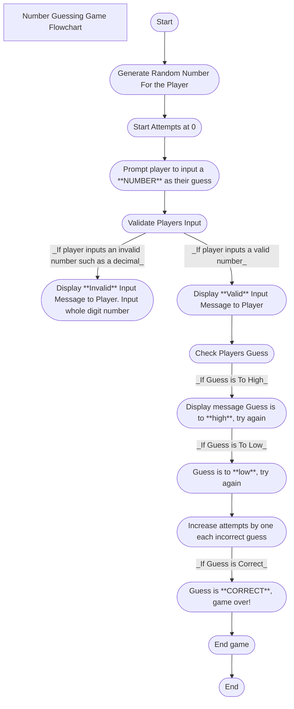

 Description of Each Step in the Process
 Generate Random Number: The computer would generate a random number that the player would then have to guess.
 Set Attempts: The attempt number would start at 0 and increase by 1 after each guess.
 Prompt Plater To Input Guess: A display would pop up after the computer generates a number informing the player to input their guess which would be a whole number.
 Valdiate the Input as Invalid or Valid number: An invalid input could be a fraction, decimal, symbol, or letter. If the player inputted an invalid number(input) a display message would prompt up informing the player to put a valid input. A valid input would be a whole number such as 1,42,23,87.
 Check Player Guess: The computer would check the players guess to see if it was low, high, or the correct number.
 Is Guess to Low: Display's a message to the player that the guess is to low, try again
 Is Guess to High: Display's a message to the player that the guess is to high, try again
 Correct Guess: Displays a message that the number guessed was correct which would then end the game.
 End: Game ends due to correct number being guessed.
