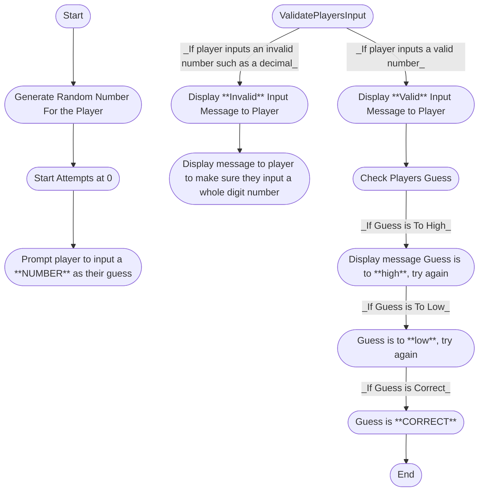

```mermaid
flowchart TD
Start([Start]) --> GenerateRandomNumber([Generate Random Number For the Player])
--> SetNumberofAttempts([Start Attempts at 0])

-->PlayerInputNumber([Prompt player to input a **NUMBER** as their guess])
ValidatePlayersInput([ValidatePlayersInput]) -- _If player inputs an invalid number such as a decimal_ --> InvalidInput([Display **Invalid** Input Message to Player])
-->CorrectError([Display message to player to make sure they input a whole digit number])
ValidatePlayersInput -- _If player inputs a valid number_ --> ValidInput([Display **Valid** Input Message to Player])

-->CheckPlayersGuess([Check Players Guess])
-- _If Guess is To High_ --> TellPlayerThereGuessistoHigh([Display message Guess is to **high**, try again])
-- _If Guess is To Low_ --> TellPlayerThereGuessistoLow([Guess is to **low**, try again])
-- _If Guess is Correct_ --> TellPlayerThereGuessisCorrect([Guess is **CORRECT**])

--> End([End])
```
