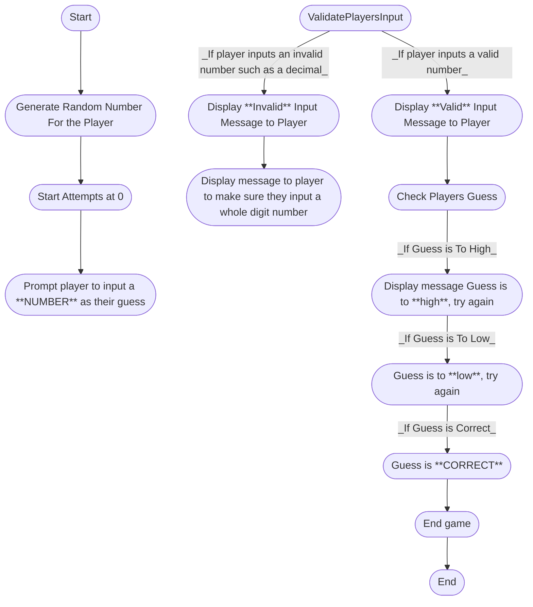

 Description of Each Step in the Process
 Generate Random Number:
 Set Attempts:
 Prompt Plater To Input Guess:
 Valdiate the Input as Invalid or Valid number: 
 Check Guess:
 Is Guess to Low:
 Is Guess to High:
 Correct Guess:
 End: 
